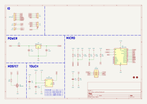
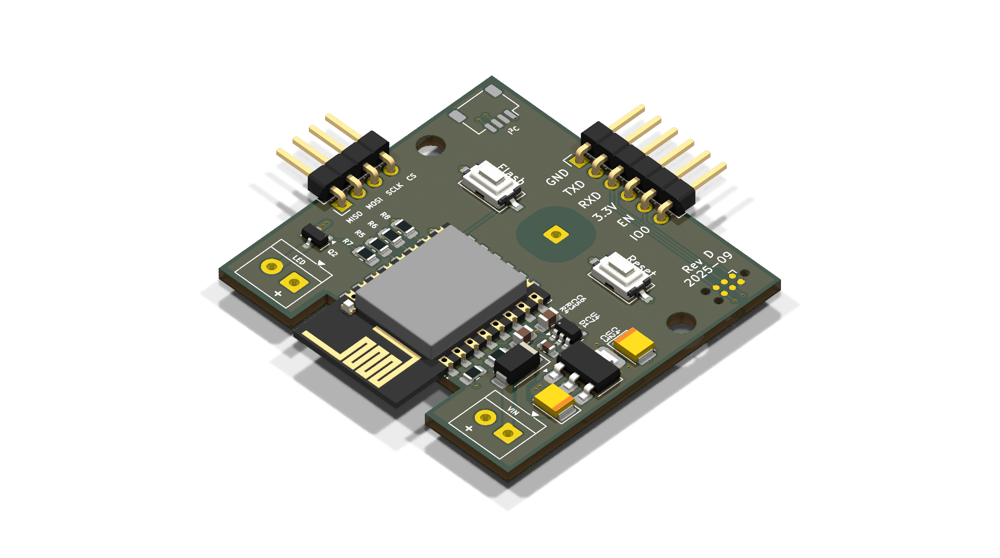

# ESPHome Reading Lamp (Lamp Control)

This project is a custom **ESP8266 (ESP-12E) + ESPHome retrofit** for a standard touch‑controlled bedside reading lamp, adding full **Wi‑Fi control and Home Assistant integration**.

Originally built for a fun (and slightly devious) bedtime automation, it’s now a clean, reusable **smart‑lamp controller** with both **open hardware** and **open firmware**.

Same lamp on the outside.  
Entirely new personality on the inside.

---

## ✨ Features

- ESP8266 / ESP‑12E based Wi‑Fi control  
- ESPHome firmware  
- Home Assistant native API integration  
- Smooth transitions and dimming  
- Designed to replace a stock capacitive touch controller  
- Brightness memory across power loss  
- Physical touch control + full network control

---

## 🗂️ Repository Structure

- `firmware/` – ESPHome configuration and device logic  
- `hardware/` – KiCad schematic, PCB, and mechanical assets  
- `docs/` – Rendered schematic and board images

---

## 🧠 Hardware Overview

The controller is built around a simple, low‑voltage architecture composed of four primary building blocks:

1. **Micro — ESP8266 Wi‑Fi Module (ESP‑12E)**  
   Provides all network connectivity, ESPHome firmware execution, and integration with Home Assistant.

2. **Mosfet — BSS138 MOSFET‑Based DC Dimmer Stage**  
   Handles low‑side PWM dimming of the 12V lamp load in a safe, fully low‑voltage design (no mains switching).

3. **Power — AMS1117‑3.3 Linear Voltage Regulator**  
   Steps the incoming 12V DC down to a stable 3.3V rail for the ESP8266 and logic circuitry.

4. **Touch — TTP223 Capacitive Touch Sensor**  
   Provides the physical touch interface for on/off control and brightness stepping without any mechanical switches.

### Schematic



### PCB Render



---

## 🏭 Manufacturing Assets

All fabrication outputs are generated from KiCad using the supplied Makefile:

```sh
make build
```

This generates, into the `hardware/build/` directory:

- Gerber files  
- Drill files  
- BOM (CSV)  
- Pick‑and‑place  
- PDF schematic

Manufacturing assets are also published as **GitHub Releases** and workflow artifacts.

### 🟣 Order a Pre‑Fab PCB (OSH Park)

If you prefer to skip fabrication setup and order the board directly, the exact PCB is available as a shared OSH Park project:

https://oshpark.com/shared_projects/FYbiIZpP

---

## 🧰 Bill of Materials (BOM) — Summary

This project retrofits a **touch‑controlled 12V DC bedside reading lamp** with a custom ESP8266 controller.

### 🪔 Base Lamp

- Touch‑control bedside reading lamp (original retail unit)  
- Any similar **12V capacitive‑touch lamp with an internal controller** can be adapted; however, the **PCB outline and mounting points are specifically designed for [this exact lamp model](https://a.co/d/2ksPzuO)**

> ⚠️ **USB Charging Port Note**  
> The original lamp’s built-in USB charging port will be **non-functional after this retrofit**. Supporting a protected 5V USB output (with proper current limiting and fault protection) was intentionally left **out of scope** to keep the board simple and safe.  
>  
> If you would like to restore USB charging, the recommended approach is to use a small, dedicated **12V → 5V buck converter module** and reuse the lamp’s original USB connector:  
> 1. Install a 12V → 5V buck converter module and connect the lamp’s 12V supply to the module’s input.  
> 2. **Remove the USB connector from the buck converter module** so you can access its 5V and GND output pads directly.  
> 3. Solder the original USB wiring to the 5V and GND output pads on the buck converter module, effectively feeding the original USB jack from the new 5V supply.  
>  
> Example module: https://a.co/d/jlBtOT4

> ♻️ **Salvage & Reuse Note**  
> The **spring contact** that connects the original lamp PCB to the outer plastic touch surface is **re‑used in this design**. Be sure to **pull and transfer this spring from the original board** when installing the new controller.
> 
> You can also optionally **salvage the following components from the original lamp PCB** to reduce parts sourcing:
> - The **MOSFET** (dimmer switch)
> - The tiny **22pF capacitor** used to decouple the touch spring
> - **Reverse‑polarity protection diode** (SS14‑class)
> 
> Salvaging these parts is optional but can simplify sourcing and keep e‑waste down.

### 🧠 Core Electronics

- **U3 — ESP‑12E / ESP8266 Wi‑Fi module**
- **U4 — TTP223‑BA6 capacitive touch sensor**
- **Q2 — BSS138 MOSFET** (low‑side PWM dimming)
- **U2 — AMS1117‑3.3 voltage regulator**
- **D1 — SS14 Schottky diode** (power protection)
- Decoupling and timing capacitors (C3–C7)
- Pull‑ups and current‑limit resistors (R3–R8)

---

## 🧑‍💻 Firmware

The device firmware is written in **ESPHome** and provides:

- Touch input handling via TTP223B capacitive IC  
- Brightness stepping with persistent memory  
- Long‑press physical power‑off  
- OTA updates and Home Assistant API integration

Firmware configuration files live in:

```
firmware/
```

---

## ⚡ Typical Use Cases

- Smart bedside reading lamps  
- Bedtime automations  
- Wake‑up fade lighting  
- General ESPHome‑controlled lighting

---

## 📄 License

This project uses **dual licensing**:

- **Firmware & configuration:** MIT License  
- **Hardware designs & mechanical files:** CERN Open Hardware License v2 – Permissive (CERN‑OHL‑P)

See the respective `LICENSE.md` files for full terms.

---

## ❤️ Why This Exists

Because sometimes the right solution to:

> “They’re still reading at 10 PM…”

is:

> “Fine. We’ll let the robots handle it.”